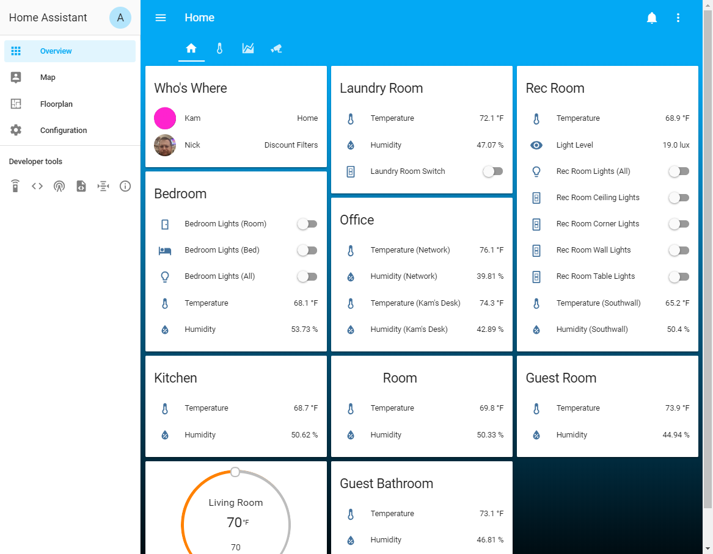
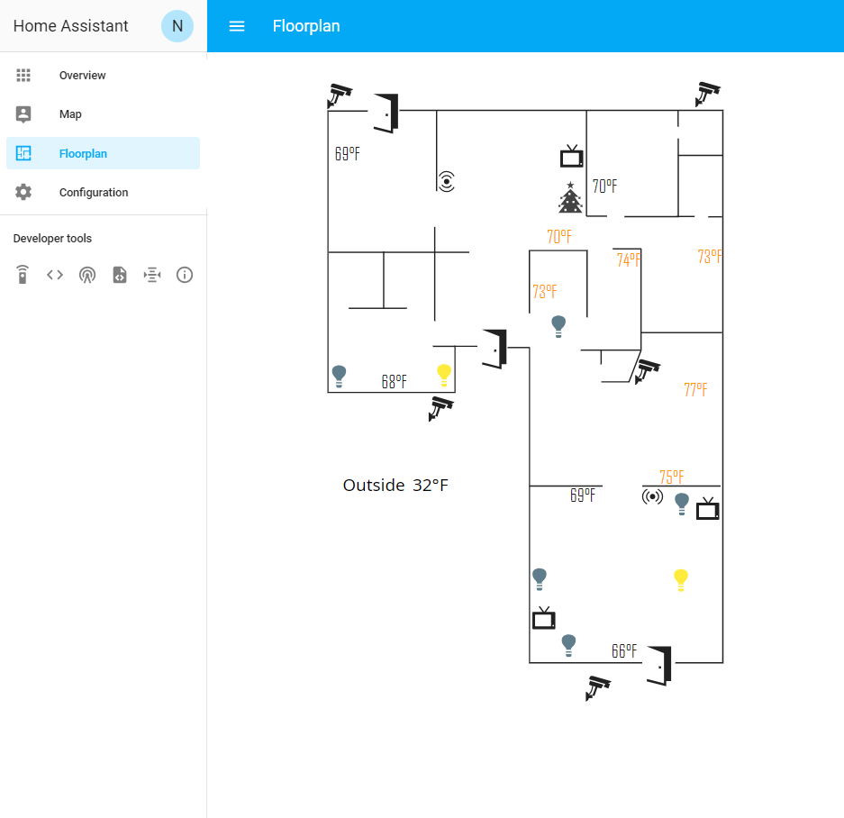
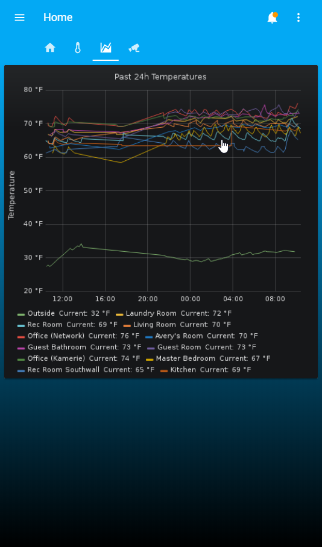

# Home-Assistant-Config
Configuration files for my Home Assistant instance.

## Devices
Here is a list of devices and quantity in my home.

### Lights
| Device | Quantity | Comment
| ---    | ---      | ---
| GoControl Z-Wave Dimmable LED Light Bulb, LB60Z-1 | 4 | Used in a ceiling fan so the fan can be on and the lights can be automatically controlled
| GE Z-Wave Plus Smart Lighting Control Motion Sensor Switch | 2 | One is in our laundry room and the other the garage. I want to get a couple more to have on all the garage switches
| GE Z-Wave Plus Smart Lighting Control Light Switch | 2 | Replaced two normal switches in our Rec Room
| GE Z-Wave Plus Smart Lighting Control Light Dimmer Switch | 2 | Replaced two dimmer switches in our Rec Room

### Sensors
| Device | Quantity | Comment
| ---    | ---      | ---
| HomeSeer HSM200 Z-Wave Multisensor with LED Indicator | 1 | Mainly wanted it to provide stability to the Z-Wave network. As a bonus is more reliable than the battery-operated Zooz 4-in-1.
| Xiaomi Mijia Temperature and Humidy Sensor | 9 | Cheap decent temperature sensor. I have a long house and one room isn't on central AC/Heat so wanted to be able to see room temperature differences.
| Xiaomi Aqara Door/Window Sensor | 3 | Waiting on these to arrive. They'll go on the three main doors to the house.

### Google Home
| Device | Quantity | Comment
| ---    | ---      | ---
| Google Home Mini | 4 | One in every major room
| Insignia Smart Speaker with Google Assistant | 1 | Came with a TV purchase, works well enough
| Chromecast Audio | 4 | One for each set of speakers (3 main rooms + garage)

### Video Media
| Device | Quantity | Comment
| ---    | ---      | ---
| Roku LE | 1 | On auxillary TV
| Roku Premier+ | 1 | On main TV
| Insignia Roku TV | 1 | In living room

## Infrastructure
I have a server which I use as a Docker host. Alongside other fun things, it runs Home-Assistant and some add-ons:

- Home Assistant ([docs](https://www.home-assistant.io/docs/installation/docker/), [docker hub](https://hub.docker.com/r/homeassistant/))
   - My zwave device is passed through to the container
- Ubiquiti Unifi Controller
   - 2 Unifi Access Points
   - 1 48 port Unifi Switch
- Node-red (I built my own image based on node10, [docs](https://nodered.org/docs/platforms/docker))
- EMQTT (Using [emqx-docker](https://github.com/emqx/emqx-docker), [official site](https://emqtt.io))
   - I have a raspberry pi running [zigbee2mqtt](https://github.com/Koenkk/zigbee2mqtt/) for zigbee devices
- InfluxDB/Grafana
   - I store all sensor data into InfluxDB
- Traefik (reverse-proxy based on Docker container labels, [official site](https://traefik.io))
- Cloud9 IDE (For easily editing Home-Assistant configuration files, [docker hub](https://hub.docker.com/r/kdelfour/cloud9-docker/))
- ShinobiPro NVR
- OPNSense router

## Home Assistant Customizations Used
For my floorplan panel I use [ha-floorplan](https://github.com/pkozul/ha-floorplan) which works brilliantly. I also use the [animated darksky weather card](https://community.home-assistant.io/t/custom-dark-sky-animated-weather-card/59816) in my Lovelace UI.

My Xiaomi sensors record temperature in Celcius, so I template them into Fahrenheit.

I have a custom "home occupancy" sensor which combines a few device trackers to see if at least one person is home.

## Screenshots
Some screenshots of what Home Assistant Looks like:

### Main Screen
A control panel for the entire house, even though most of it is just temperature/humidity for the various rooms.

### Floorplan

### Trends
I use Grafana to aid in visualizing trends from my Home Assistant data.

