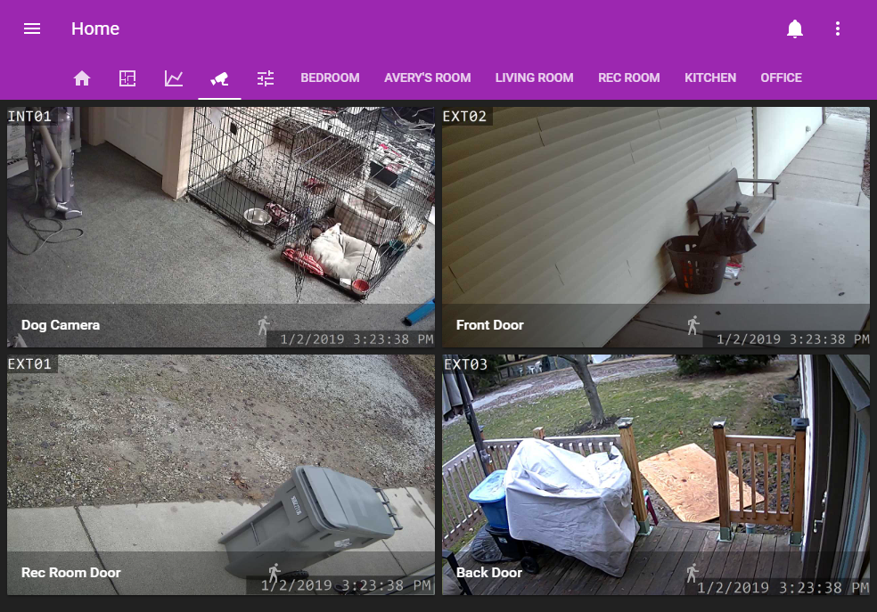
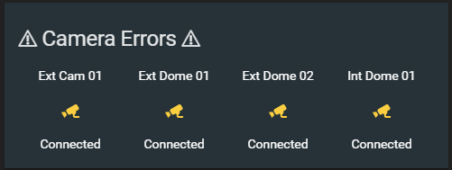

# Cameras
I have some affordable PoE Cameras which are connected to Blue Iris, providing
an [mjpeg camera](https://www.home-assistant.io/components/camera.mjpeg/) to Home Assistant.

I whitelist my Home Assistant IP address in BlueIris so I don't need a password.
(See [this forum post](https://community.home-assistant.io/t/blue-iris-integration-tutorial/71863/9?u=nwesterhausen))

## CCTV Lovelace Panel
This panel shows the view from each camera, and clicking on any camera will open
up a live view from the camera. 

There also are two [entity-filter]() cards which display only if they have something
important to tell me about.

