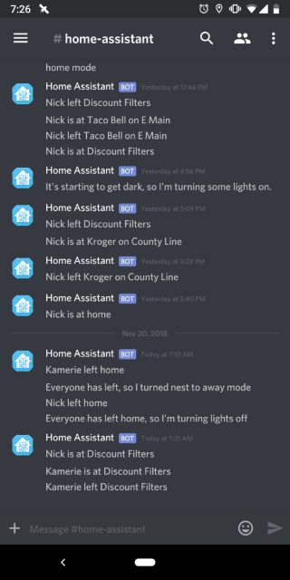

One of the neat things I use Home Assistant for is notifying my wife and I when one of us arrives at a common destination, whether on errands or as part of the workday. I use a node-red flow to send a message to Discord when someone enters or leaves a zone. In the picture here, you can see where she dropped me off at work and my trip to Taco Bell the day before.

